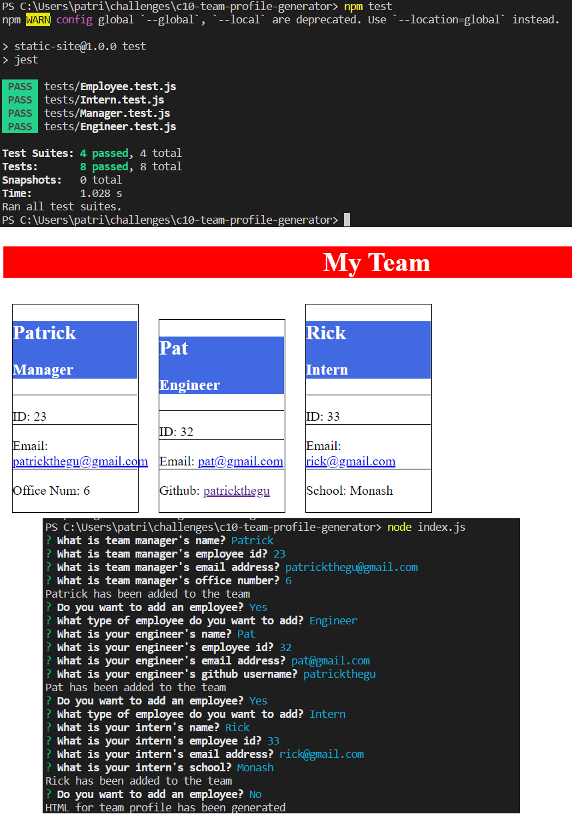

# Team Profile Generator

## Table of Contents

[Description](#description)

[Installation Instructions](#installation)

[Usage Instructions](#usage)

[License](#license)

[Github](#github)

## Description

A command line run object oriented team profile generator that takes a user's input following prompts for team member info.

[Screenrecording](./screenrecording.mp4)

## Installation Instructions

Download from Github

## Usage Instructions

cd to appropriate directory, run npm i, run npm test, upon passing tests, run command node index.js, follow prompts, success message will be displayed upon generation of html file for team profile

## License

[Apache License 2.0](https://opensource.org/licenses/Apache-2.0)

## Github

[patrickthegu](https://github.com/patrickthegu)

